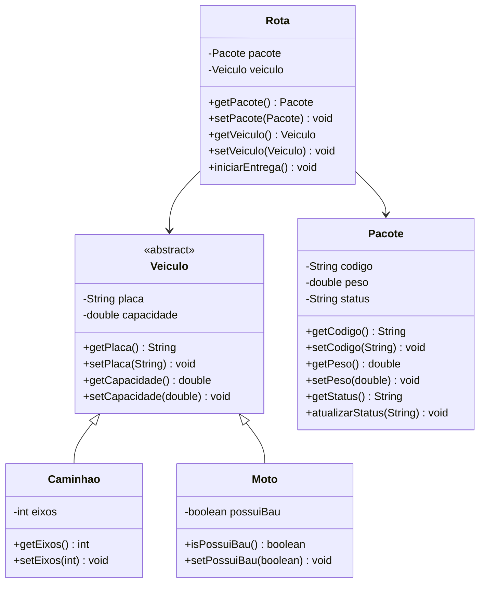

# FiapDelivery

## Sobre o projeto

O FiapDelivery nasceu de um código legado com sérios problemas de qualidade: nomes sem sentido, atributos expostos, código duplicado e uma associação que só permitia entregas de caminhão. Este projeto é a **refatoração completa** desse código, aplicando os princípios de Orientação a Objetos e Clean Code para entregar uma solução escalável e fácil de manter.

**Tópicos avaliados:** Encapsulamento, Herança, Associação, Construtores, Documentação e Clean Code.

## Funcionalidades

- Cadastro de veículos da frota (caminhão e moto), com placa e capacidade de carga.
- Cadastro de pacotes, com código, peso e status.
- Criação de rotas que associam um pacote a um veículo.
- Início da entrega, que coloca o pacote "Em trânsito".
- Validação dos dados na criação e na alteração dos objetos.

## Do legado à solução

| Problema no legado | Solução aplicada |
|---|---|
| Nomes sem sentido (`pl`, `cap`, `p`, `cod`, `s`, `p1`, `c1`, `vai`, `muda`) | Nomes claros: `placa`, `capacidade`, `peso`, `codigo`, `status`, `pacote`, `veiculo`, `iniciarEntrega`, `atualizarStatus`. Classes em PascalCase |
| Todos os dados `public` | **Encapsulamento:** atributos `private` com getters e setters |
| Dados inválidos aceitos (ex.: capacidade `-500.0`) | Validação nos construtores e setters, com `IllegalArgumentException` |
| Código duplicado em `caminhao` e `moto` | **Herança:** `Caminhao` e `Moto` estendem a classe base `Veiculo` |
| `Rota` só aceitava caminhão | **Associação flexível:** `Rota` depende de `Veiculo`, então aceita qualquer tipo de veículo |
| Objetos criados vazios e preenchidos depois | **Construtores** que já recebem e validam os dados |
| Sem documentação | **Javadoc** em classes, construtores e métodos principais |

## Arquitetura

O projeto está dividido em dois packages:

```
br.com.fiapdelivery
├── model   -> classes do domínio
│   ├── Veiculo   (abstrata)
│   ├── Caminhao
│   ├── Moto
│   ├── Pacote
│   └── Rota
└── main    -> ponto de entrada
    └── Principal
```

### Diagrama de classes



O diagrama exportado do Astah também faz parte deste repositório (arquivo PNG).

## Classes

| Classe | Responsabilidade |
|---|---|
| `Veiculo` | Classe abstrata com os atributos comuns da frota (`placa` e `capacidade`) e suas validações. Evita duplicação de código |
| `Caminhao` | Veículo de grande porte, caracterizado pela quantidade de `eixos` |
| `Moto` | Veículo ágil para entregas leves, que pode ou não ter baú (`possuiBau`) |
| `Pacote` | Encomenda com `codigo`, `peso` e `status`. Nasce com o status "Pendente" |
| `Rota` | Associa um `Pacote` a um `Veiculo` e inicia a entrega |
| `Principal` | Demonstra o sistema: validação de dados inválidos e entregas com caminhão e moto |

## Regras de negócio e validações

- A placa não pode ser nula ou vazia.
- A capacidade do veículo e o peso do pacote devem ser maiores que zero (`NaN` e valores infinitos também são rejeitados).
- O código e o status do pacote não podem ser nulos ou vazios.
- A quantidade de eixos do caminhão deve ser maior que zero.
- Uma `Rota` não aceita pacote ou veículo nulos.

## Decisões de design

- **`Veiculo` abstrata:** não faz sentido existir um veículo "genérico", apenas tipos concretos.
- **`Rota` depende da abstração:** novos veículos (van, bicicleta, drone) podem ser criados sem alterar a `Rota`.
- **Falha rápida:** dados inválidos são rejeitados no momento da criação, impedindo que objetos em estado inconsistente existam no sistema.

## Tecnologias

- Java
- Eclipse IDE
- Astah (modelagem UML)
- Git e GitHub

## Autor

Desenvolvido por **João Carmo Cassu De Castro** - FIAP.
